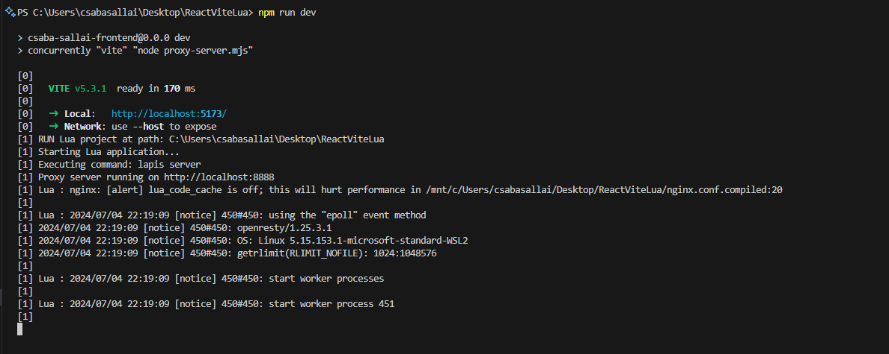
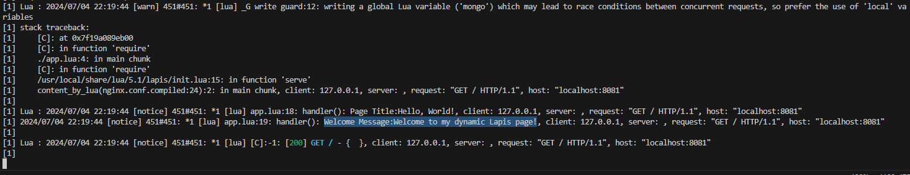

## REACT + VITE + LUA(LAPIS)

Windows supported (WSL)

## Screenshots





# Install - WINDOWS (WSL)

Run both powershell script (you don't need to install anything manually, pwsh script will enable & install WSL, downloading install LUA/Luarocks.. Lapis..)
```powershell
powershell -ExecutionPolicy ByPass -File .\install_part1.ps1 
```
(WSL install & enable part, it requires admin previliges)
```powershell
powershell -ExecutionPolicy ByPass -File .\install_part2.ps1 
```

# Install - Linux

You need to install Lua5.1, OpenResty (Nginx), Luarocks, Lapis

Installation script: TBA


# RUN
Don't forget to make the run_lua.sh executable.
```
chmod +x run_lua.sh
```

To run the server simply execute the following command:
```
npm run dev
```
