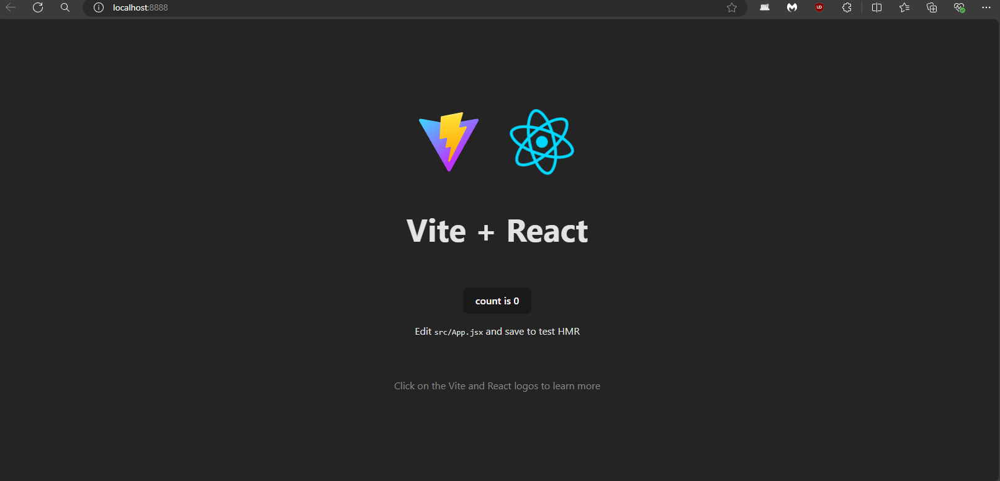
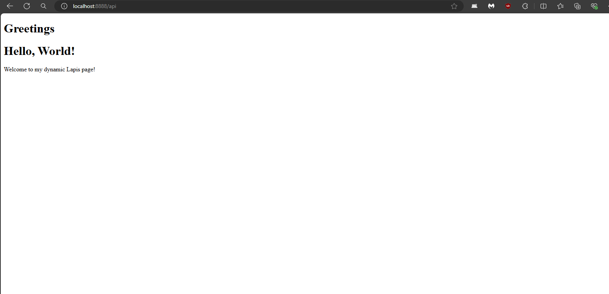
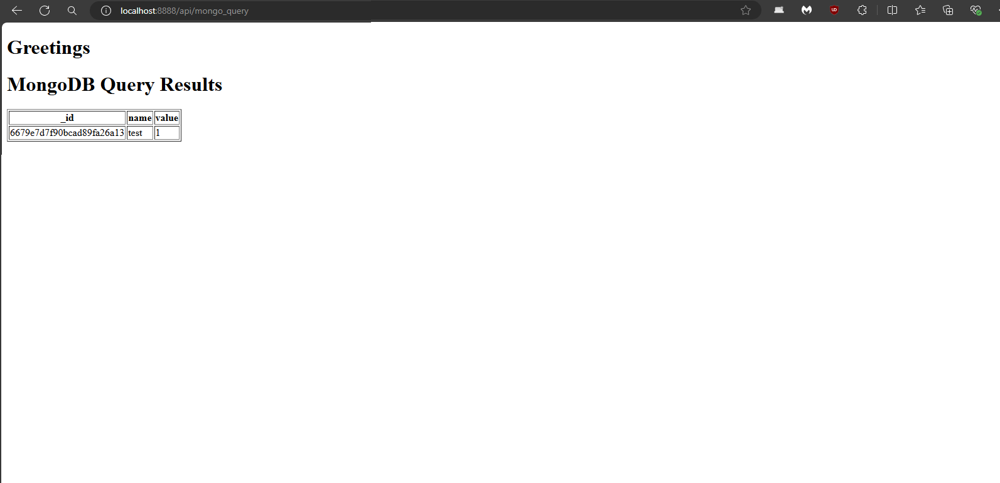

## REACT + VITE + LUA

## PRE-installation

Disclamer:
In order to use this on Windows please install WSL!


* Install NodeJS 20 LTS
```
1. sudo apt-get update
2. curl -fsSL https://deb.nodesource.com/setup_20.x | sudo -E bash -
3. sudo apt-get install -y nodejs

```

## Screenshots






# Install

* Install LUA 5.1, LuaRocks and OpenResty [WSL/with Ubuntu 22.04], and finally install Lapis

Official installation guide of OpenResty: 
https://openresty.org/en/linux-packages.html#ubuntu


```
0. sudo apt install lua5.1
1. wget -O - https://openresty.org/package/pubkey.gpg | sudo gpg --dearmor -o /usr/share/keyrings/openresty.gpg
2. echo "deb [arch=$(dpkg --print-architecture) signed-by=/usr/share/keyrings/openresty.gpg] http://openresty.org/package/ubuntu $(lsb_release -sc) main" | sudo tee /etc/apt/sources.list.d/openresty.list > /dev/null
3. sudo apt-get update
4. sudo apt-get -y install openresty
5. sudo apt-get install luarocks
6. sudo apt-get install libssl-dev
7. luarocks install lapis
8. sudo luarocks install lua-resty-rsa
9. sudo apt-get install libbson-dev
10. sudo apt-get install libmongoc-dev
11. sudo luarocks install lua-mongo
```

# RUN
To run the server simply execute the following command:
```
npm run dev
```
